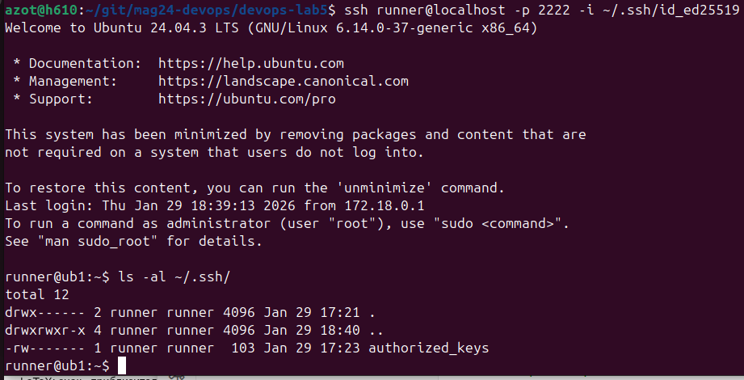

## Подготовка образа

ubuntu:24:04 open-ssh  
создаём пользователя runner  
[Dockerfile](./ssh-containers/Dockerfile)

## Собираем контейнеры
собираем два сервиса ub1 и ub2  
у каждого монтируем домашние папки для runner  
в них есть .ssh/authorized_keys  
здесь же указываем права на .ssh/authorized_keys и стартуем SSH-сервер  
сеть my_net  
[docker-compose.yml](./docker-compose.yml)

Cборка образов
```
docker-compose build
docker-compose build --no-cache
```

запускаем контейнеры (-d - как демон)
```
docker compose up
docker compose up -d
```


Остановить все контейнеры проекта (без удаления):
```
docker compose stop
```
Остановить и удалить контейнеры, сети (но не тома):
```
docker compose down
```


пробуем подключится по ssh, проверим права доступа на ключи  
получилось не сразу, после монтирования в compose все права затираются  
устанавливал права в docker-compose.yaml после запуска контейнера  
странная конструкция получилась - после этого на хосте папки поменяли хозяина  
может, проще надо было делать copy в dockerfile
```
ssh runner@localhost -p 2222 -i ~/.ssh/id_ed25519
```
